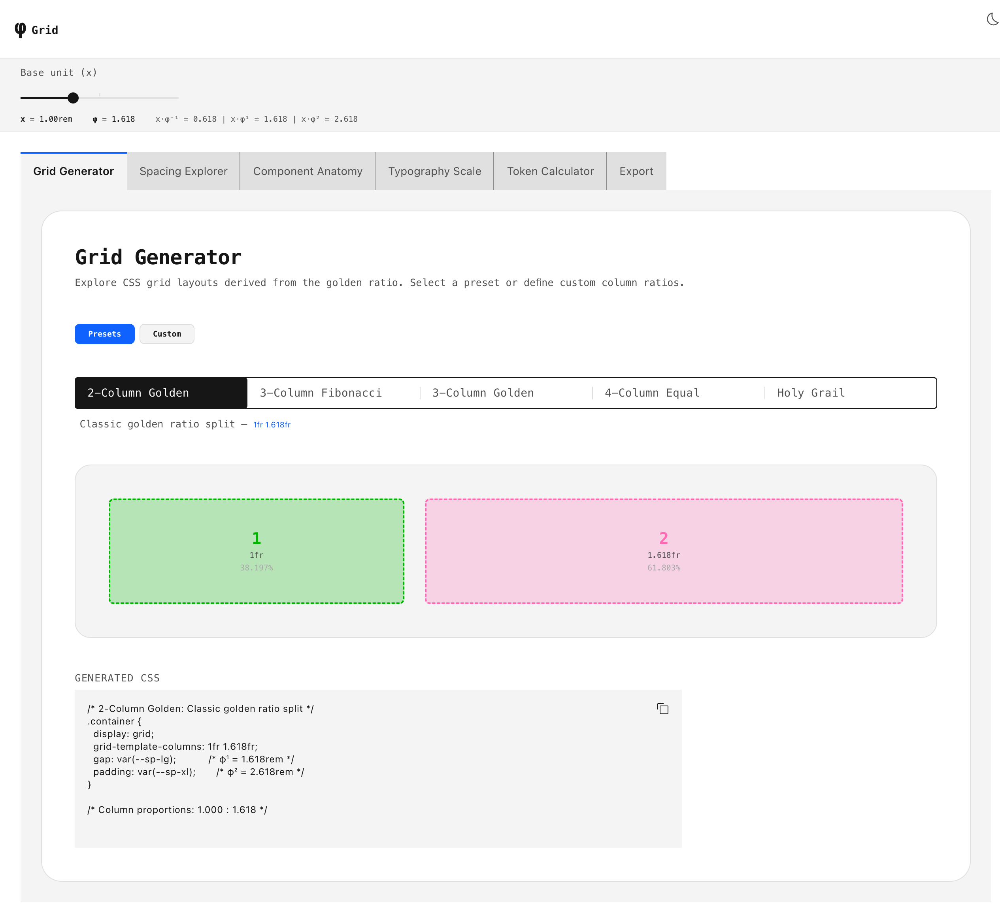
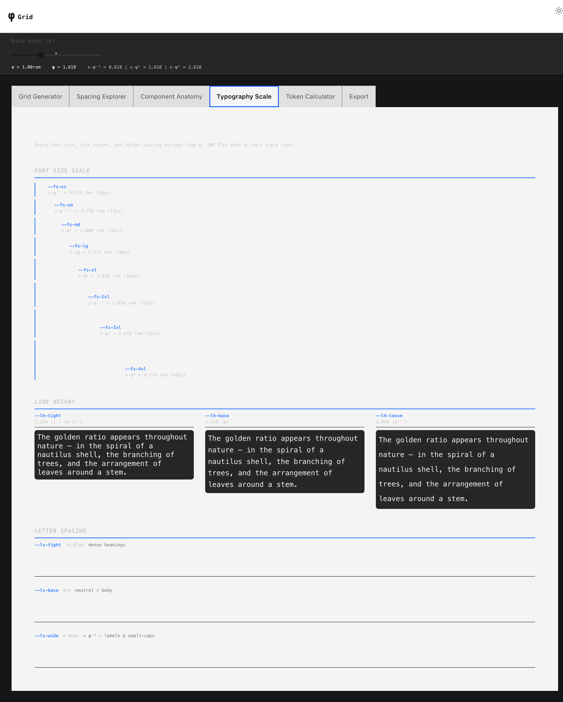

# φ Grid

> A golden ratio design system playground — explore spacing, typography, and layout grids derived entirely from φ.


## What it does

- **Generates CSS grid layouts** from golden ratio column proportions (1:φ, Fibonacci, Holy Grail)
- **Computes a full spacing + typography scale** from a single base unit × powers of φ
- **Exports design tokens** as CSS custom properties, SCSS variables, or JS/TS constants
- **Live preview** — drag the base unit slider, watch everything recompute in real time

## Panels

| Panel | Purpose |
|-------|---------|
| **Grid Generator** | Golden ratio grid presets with live CSS output |
| **Spacing Explorer** | Visual spacing scale from `φ⁻³` to `φ⁴` |
| **Component Anatomy** | Padding, margin, and border radius mapped to φ tokens |
| **Typography Scale** | Font sizes, line heights, and letter spacing — all from φ |
| **Token Calculator** | Snap any arbitrary value to the nearest φ token |
| **Export** | Download tokens as `.css`, `.scss`, or `.ts` |

## Getting Started

```bash
git clone https://github.com/stussysenik/phi-grid.git
cd phi-grid
yarn install
yarn rw dev
```

Open `http://localhost:3000`. That's it.

## Tech Stack

```
RedwoodJS     — full-stack React framework
Carbon Design — IBM's component library (dark/light theme)
φ math        — every value derives from 1.6180339887…
SCSS          — token system + Carbon overrides
Vite          — dev server + HMR
```

## Screenshots

### Light Theme — Grid Generator


### Dark Theme — Grid Generator


### Typography Scale


### Spacing Explorer


## How the Math Works

```
φ = (1 + √5) / 2 ≈ 1.618033988…

Given a base unit x (default 1rem):

  x · φ⁻³ = 0.236rem    →  --sp-2xs
  x · φ⁻² = 0.382rem    →  --sp-xs
  x · φ⁻¹ = 0.618rem    →  --sp-sm
  x · φ⁰  = 1.000rem    →  --sp-md
  x · √φ  = 1.272rem    →  --sp-sqrt
  x · φ¹  = 1.618rem    →  --sp-lg
  x · φ²  = 2.618rem    →  --sp-xl
  x · φ³  = 4.236rem    →  --sp-2xl
  x · φ⁴  = 6.854rem    →  --sp-3xl

The same principle applies to font sizes, line heights,
breakpoints, and border radii — one ratio, one source of truth.
```

## License

MIT
